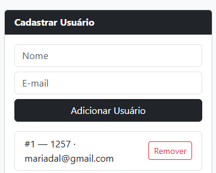
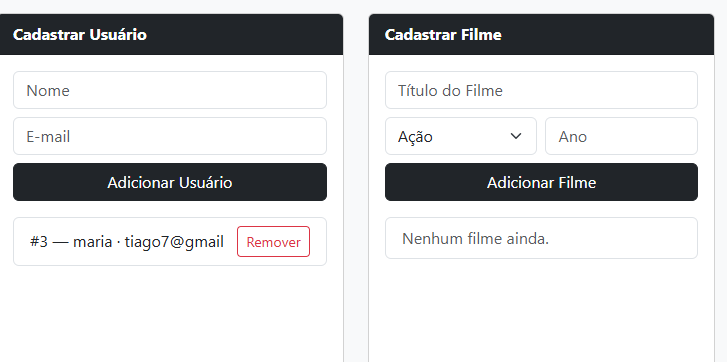

```markdown
# Relatório de Avaliação Heurística — Projeto 1
Autor: <Maria Dalva de Oliveira Gomes>
Data: 06/07/2026
Score Lighthouse (Acessibilidade): 88 / 100

## Problema 1
- Onde: <tela / cadastro de usuário>
- O que observei: <Consigo digitar número no campo de nome>
- Heurística violada: #<Prevenção de erros>
- Gravidade: <4>
- Correção proposta: <Implementar validação do campo Nome utilizando expressão regular (Regex) no frontend e no backend, impedindo o envio e o armazenamento de nomes contendo números ou caracteres inválidos.>
- Evidência: <link do print ou nome do arquivo de imagem>

## Problema 2
- Onde: <tela / Remover ou adicionar>
- O que observei: <Ao criar/remover algo, o usuário não recebe feedback>
- Heurística violada: #<Visibilidade do status>
- Gravidade: <2>
- Correção proposta: <Implementar pop up,caixas de mensagem com mensagem de sucesso quando o usuário executar uma ação>
   - Evidência: <)

## Problema 3
- Onde: <Acessibilidade>
- O que observei: <O documento não tem um ponto de referência principal.>
- Heurística violada: #<Flexibilidade e eficiência>
- Gravidade: <3>
- Correção proposta: <Insira a tag de abertura <main> no início do  HTML e a tag de fechamento </main> no final.>
   - Evidência: <)


## Resumo
- Total de problemas: __
- Problemas de gravidade 3–4 (prioritários): __
- Score de acessibilidade: 88 / 100
- Os 3 que vou corrigir primeiro no E7: ...
```
